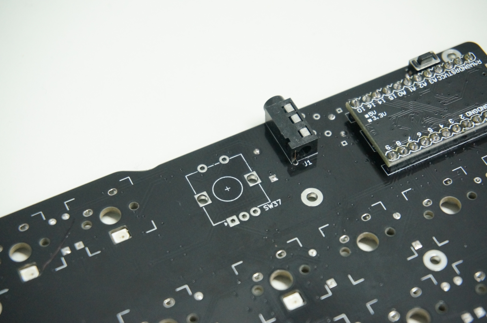
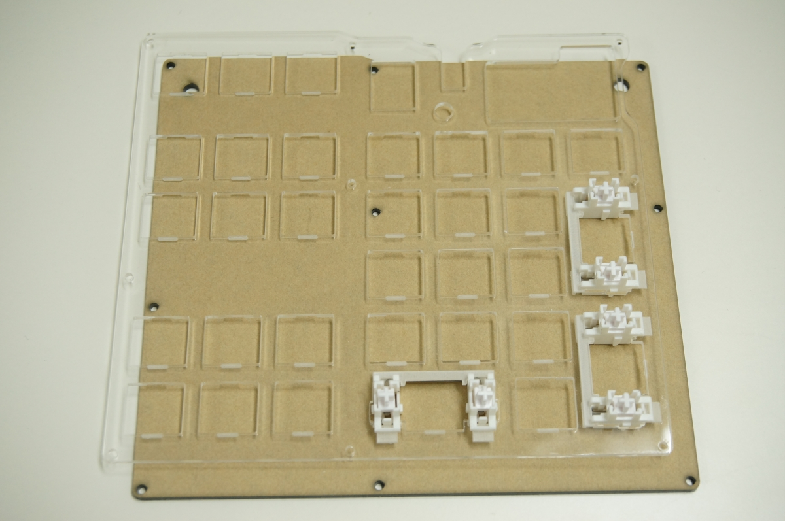
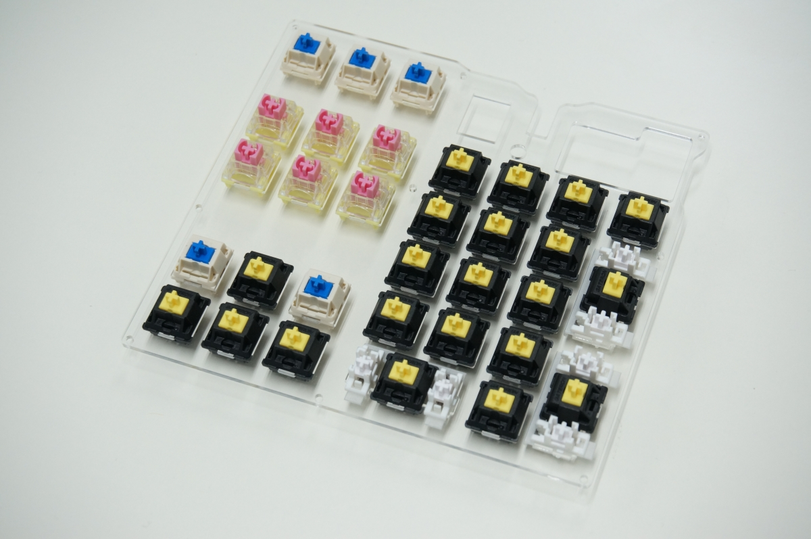
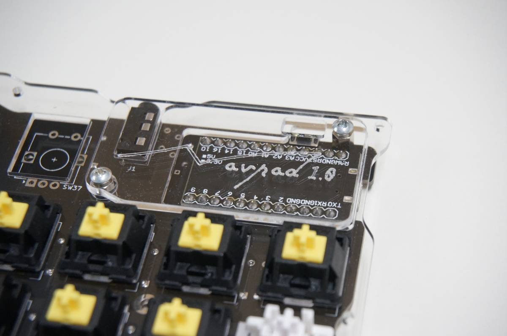
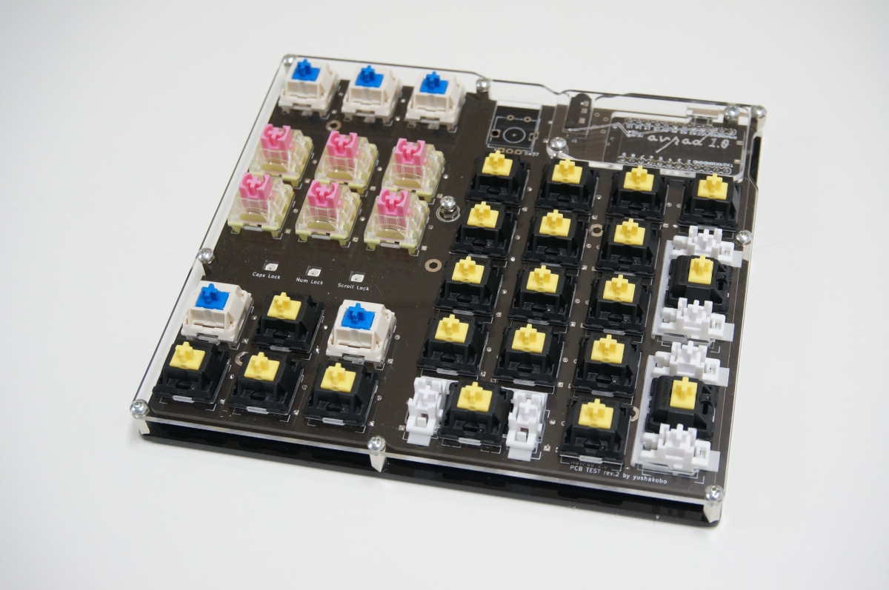

# Navpad 1.0をほかのキーボードと接続する<br />(上級者向けの改造)

この機能は基本的にサポート外のものとなります。ご自身にて調査の上、ご活用ください
。

[『キーボードアクリルプレート - Navpad 1.0』](https://shop.yushakobo.jp/products/keyboard_acrylic_plate)をご注文いただくことで、Navpad 1.0基板上にTRRSジャックを実装することができます。

### 追加で必要になる部品

|名称|数量|備考|
|---|---|---|
|キーボードアクリルプレート|一式|
|TRRSジャック|1個|
|抵抗|1個|220Ω程度のもの|
|M2 7mm スペーサー|2個|ProMicroカバー部に使用します<br />(キット付属のProMicroカバーを使用する場合は不要)|

※本ビルドガイド中のアクリルプレートの画像は開発中のもののため、お届けする製品版とは一部デザインが異なります。

基本の組み立て方とは次の手順が異なりますので、それぞれ読み替えた上作業を進めましょう

```
3. リセットスイッチのはんだ付け
5. ファームウェアの書き込み
6. プレートの準備
7. キースイッチの取り付け
9. キースイッチ、ロータリーエンコーダーのはんだ付け
10. ProMicroカバーの取り付け
11. ボトムプレートの取り付け
```

### 3a. リセットスイッチのはんだ付け

基板裏面より、用意した抵抗をはんだ付けします


また、基板表面よりTRRSジャックをはんだ付けします



### 5a. ファームウェアの書き込み

`Helix rev3 LP`右手側と接続する場合、ファームウェアは`yushakobo/navpad/10`ではなく`yushakobo/navpad/10_helix_r`を使用します。

`Helix rev3 LP`**左**手側やそのほかのキーボードと接続する場合は、`yushakobo/navpad/10_helix_r`をもとにファームウェアを構成して書き込みます。

### 6. プレートの準備

プレート表面の保護シートを剥がします


スタビライザーを装着します(アクリルプレートを使用する場合のみ、プレートマウント用スタビライザーを使用することができます)

***アクリルプレートを使用する場合、Numpad部のレイアウトは2Ux3で固定となります。***



### 7a. キースイッチの取り付け

アクリルプレートに破損がないよう注意してキースイッチを取り付けます



* ロータリーエンコーダーを使用する場合はここで忘れず基板に取り付けましょう

### 9.キースイッチ、ロータリーエンコーダーのはんだ付け

アクリルプレートに破損がないよう注意しつつPCBに載せます。このとき、キースイッチが基板にしっかりと差し込まれていることを確認します


### 10. ProMicroカバーの取り付け

用意したスペーサーを使用し、アクリル製ProMicroカバーを取り付けます



### 11. ボトムプレートの取り付け

キット付属の7mmスペーサーを使用し、ボトムプレートを取り付けます



