# Navpad 1.0 ビルドガイド

※本ビルドガイドの画像はお手元の製品と一部異なる場合があります

## 必要な部品

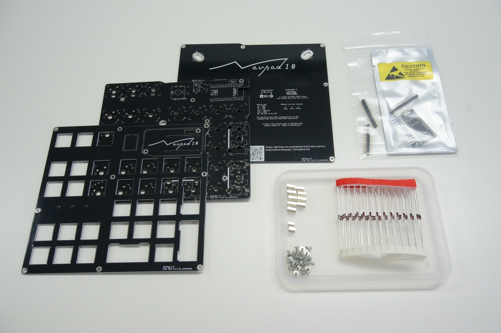

|部品名|数量|備考|
|---|---|---|
|基板|1枚|
|トッププレート|1枚|
|ボトムプレート|1枚|
|ダイオード|36個|スルーホールにのみ対応|
|ProMicro|1個|
|コンスルー|2本|MAC8製 XB-3-2.5-12P|
|タクトスイッチ|1個|
|M2 4mm ネジ|22本|
|M2 7mm スペーサー|9個|
|M2 5mm スペーサー|2個|
|Cherry MX互換キースイッチ|~35個|Numpad部分のレイアウトにより変動|
|Cherry MX互換キーキャップ|~35個|Numpad部分のレイアウトにより変動|
|ゴム足|4個|

## オプション部品

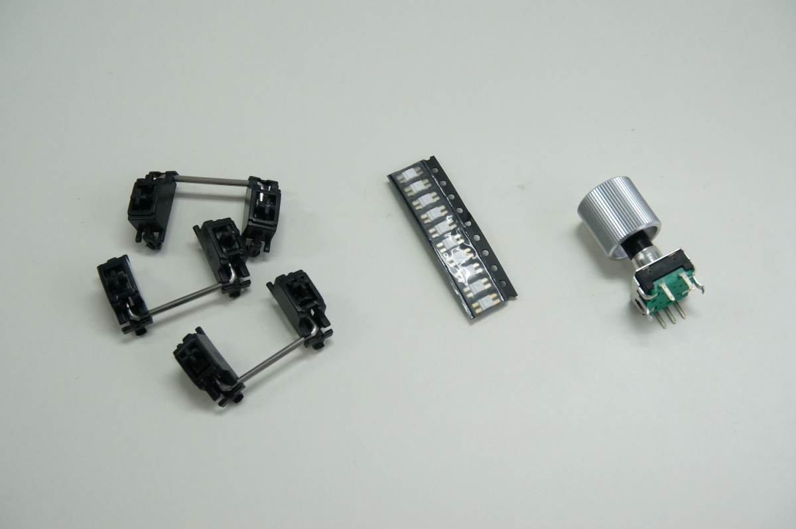

|部品名|数量|備考|
|---|---|---|
|スタビライザー 2Uサイズ|~3個|`0`キーや`Enter`キーを2Uとする場合に必要|
|LED(SK6812MINI-E)|9個|各種インジケーターとして使用|
|ロータリーエンコーダー|1個|
|ロータリーエンコーダー用ノブ|1個|

## 組み立ての前に

作業の前に必ずこのビルドガイドを最後までお読みください。また、***以降の作業では先端の非常に熱くなるはんだごてを扱います。作業の途中に席を離れる際は電源を切るなど、やけどや怪我には中文ご注意ください。***

## 組み立ての流れ

1. (オプション)LEDのはんだ付け
1. ダイオードのはんだ付け
1. リセットスイッチのはんだ付け
1. コンスルーの取り付け
1. ファームウェアの書き込み
1. プレートの準備
1. キースイッチの取り付け
1. ロータリーエンコーダーの取り付け
1. キースイッチ、ロータリーエンコーダーのはんだ付け
1. はんだ付けしたキーの動作確認
1. ProMicroカバーの取り付け
1. ボトムプレートの取り付け
1. キーキャップ/ロータリーエンコーダー用ノブの取り付け

### 1. (オプション)LEDのはんだ付け

\*LEDの取り付けは最後へ回すことができます

基板上、次の箇所にLEDを取り付け、はんだ付けします

LEDにはそれぞれ向きがあり、取り付ける場所によって向きが異なりますのでご注意ください

### 2. ダイオードのはんだ付け

基板上`[DXX |]`とある位置にダイオードを差し込み、はんだ付けします。このとき、ダイオードにある黒い帯が基板の四角い穴に合うように差し込みます

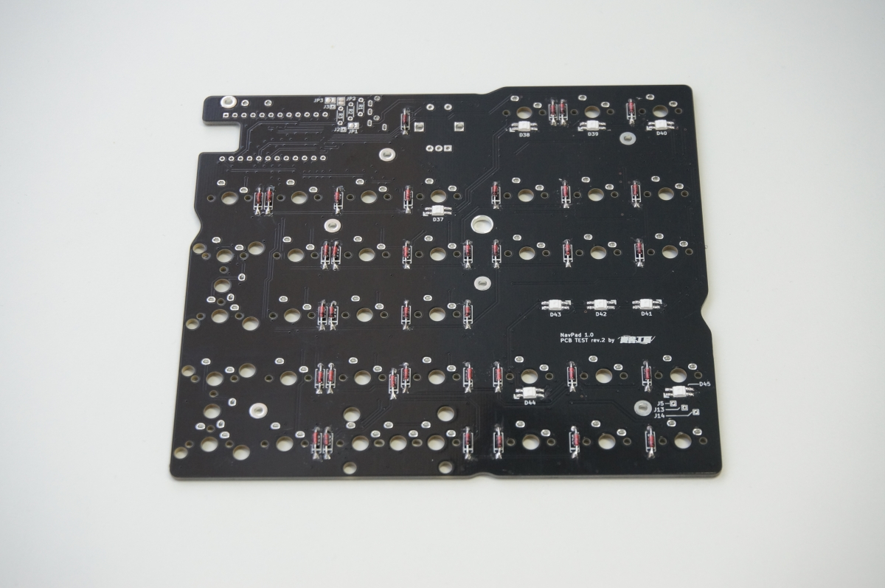

長く余ったピンは適当な長さに切りそろえます

### 3. リセットスイッチのはんだ付け

基板を裏返し、右上の`Reset`とある位置にタクトスイッチを取り付け、はんだ付けします

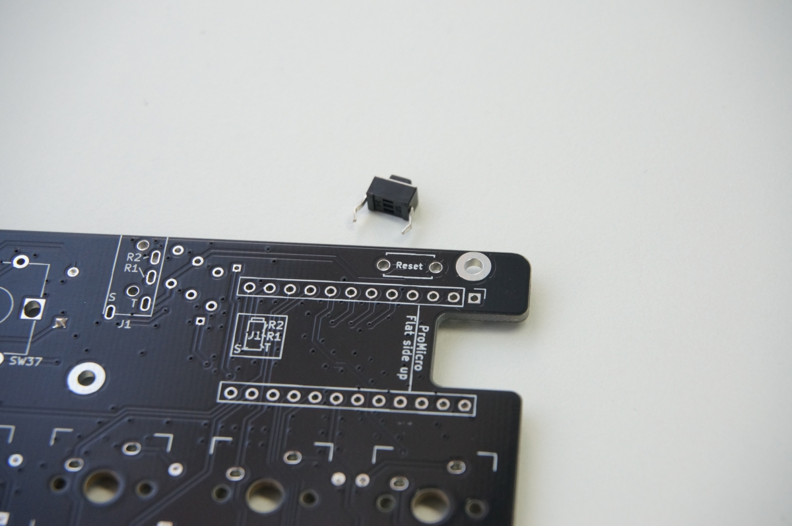

### 4. コンスルーの取り付け

コンスルーの向きを揃えて基板に差し込み、ProMicroとはんだ付けします

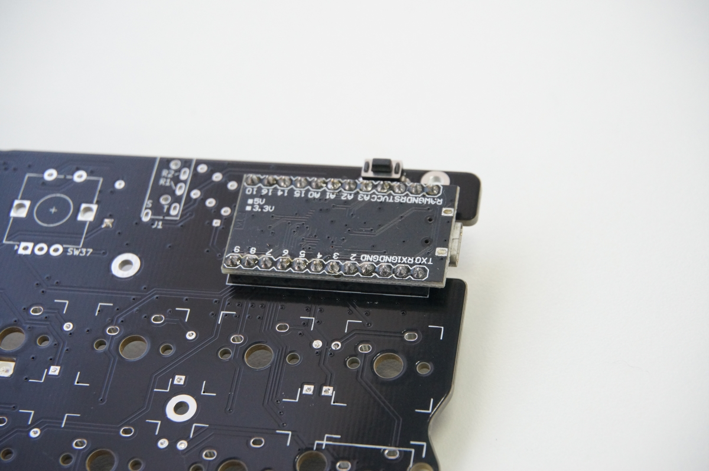

このとき、ダイオードやリセットスイッチを取り付けた基板とは***はんだ付けしません***

### 5. ファームウェアの書き込み

Navpad 1.0はファームウェアとしてqmk_firmwareを使用しています。[公式のDocs]()のとおりに環境を用意し、書き込みます。

コマンドラインからの書き込みを予定している場合は必要な環境のダウンロードに時間がかかることがあるため、前もってダウンロードを進めておくとスムーズです。

`qmk flash -kb yushakobo/navpad/10 -km default`

ファームウェアの書き込みが完了したら、はんだ付けしたLEDが白色に光ることを確認しましょう(CapsLockやNumLockがオンになっていると一部は青く点灯します)

### 6. プレートの準備

トッププレート右上のProMicroカバー部分を折り取ります

オプションのロータリーエンコーダーを取り付ける場合は、となりの四角い部分も折り取ります

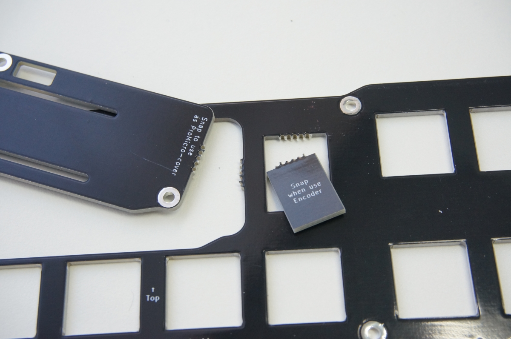

折り取った部分はささくれになり、怪我の原因となるため、やすりを用いて端面を整えます

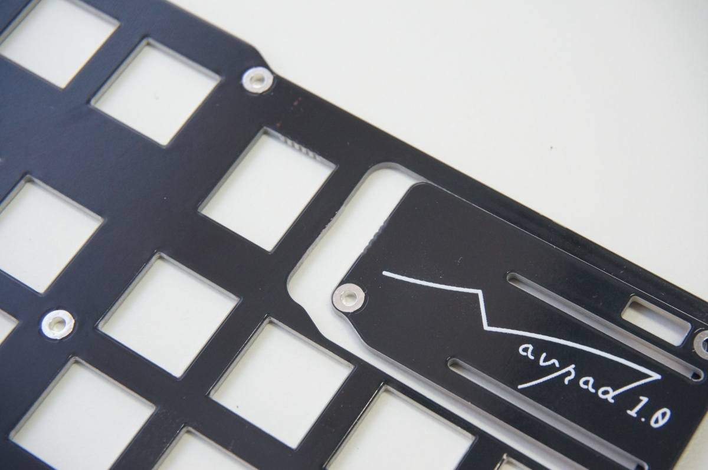

### 7. キースイッチの取り付け

準備したトッププレートにキースイッチを取り付けます。このとき、右下部のレイアウトによって取り付け位置や向きが異なるので注意します

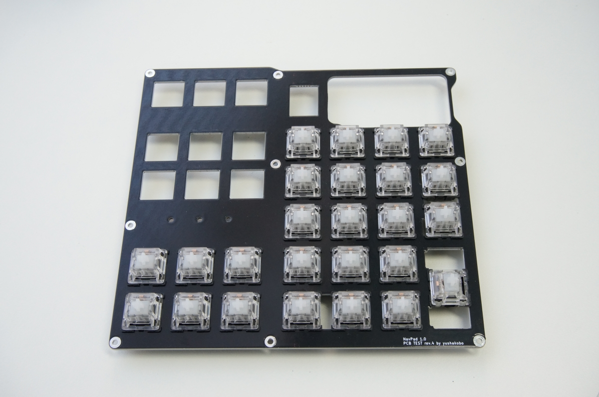

2Uを使うレイアウトの場合、このタイミングで基板にスタビライザーを取り付けます

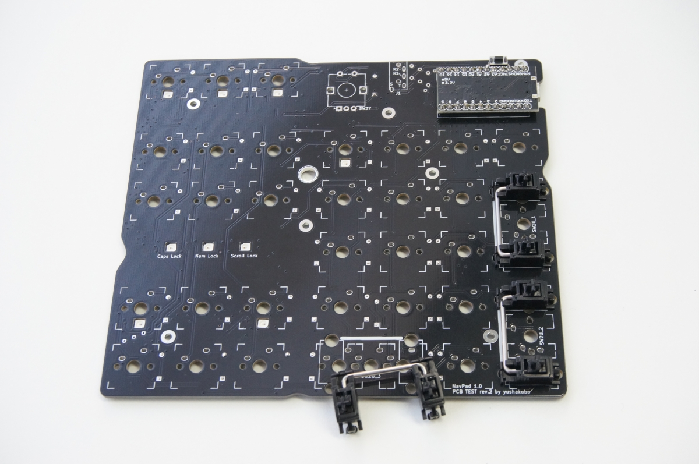

### 8. (オプション)ロータリーエンコーダーの取り付け

中央上部にロータリーエンコーダーを取り付けます

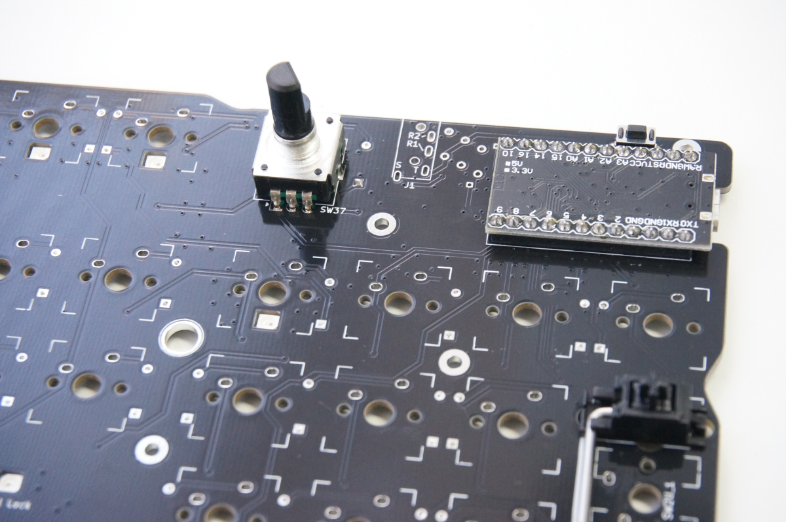

### 9. キースイッチ、ロータリーエンコーダーのはんだ付け

基板とトッププレートを組み合わせ、キースイッチとロータリーエンコーダーをはんだ付けします

### 10. はんだ付けしたキーの動作確認

[qmk_configuratorのtest画面](https://config.qmk.fm/#/test)などを使用して、キーの動作を確認します

### 10. ProMicroカバーの取り付け

ProMicroカバー部に短いスペーサーを取り付けます。

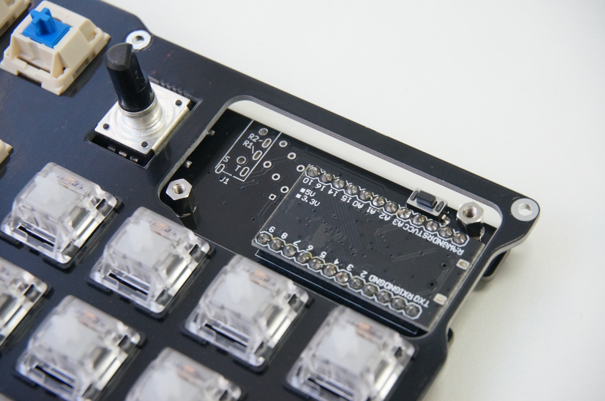

ProMicroカバーを乗せ、ネジ止めします

### 11. ボトムプレートの取り付け

長いほうのスペーサーを取り付けます

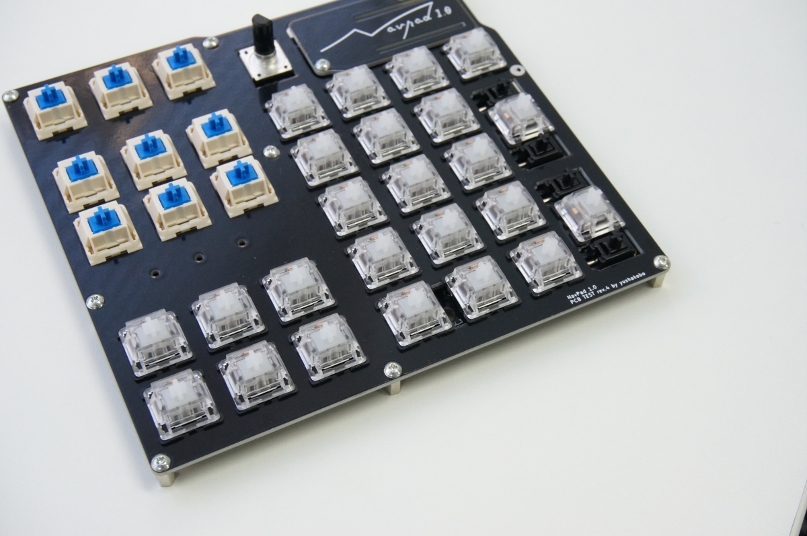

ボトムプレートのゴム足取り付け目安位置(4箇所)にゴム脚を貼り付け、ネジ止めします

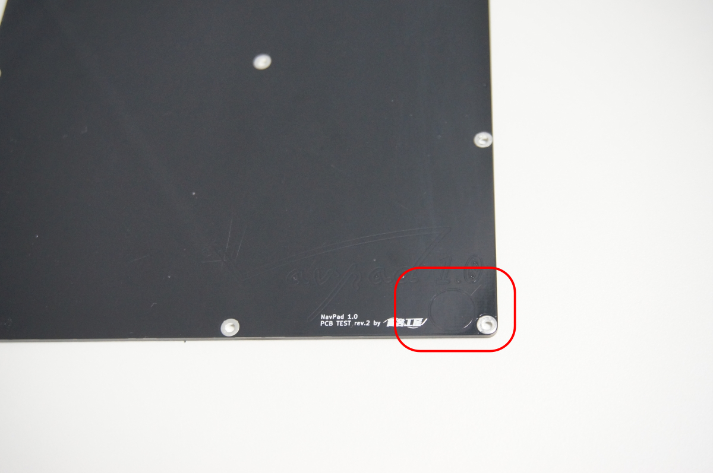

### 12. キーキャップ/ロータリーエンコーダー用ノブの取り付け

キーキャップ、ロータリーエンコーダー用ノブを取り付けて完成です

