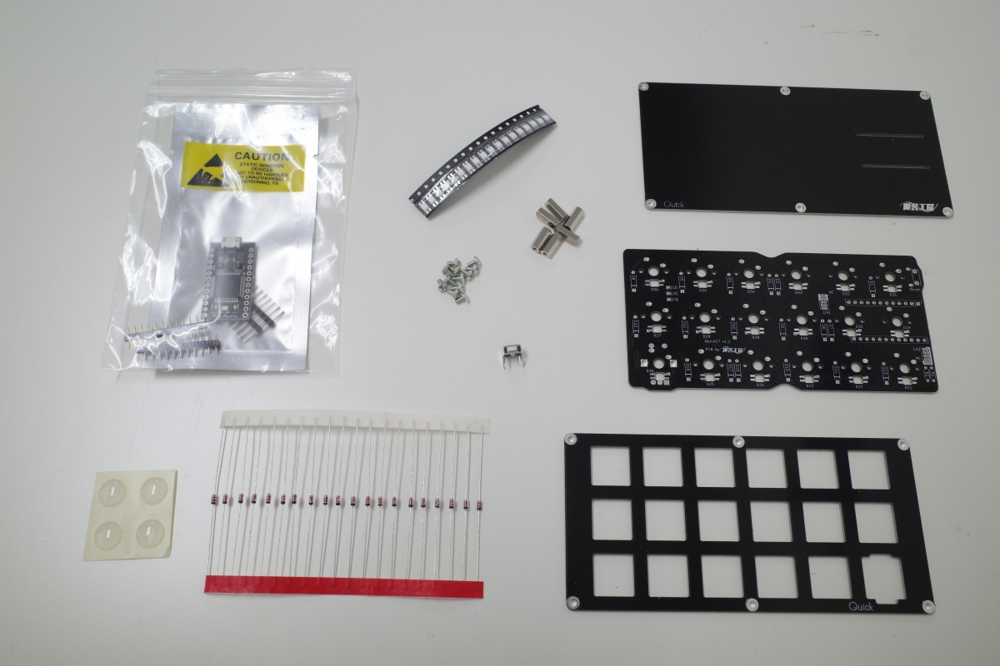
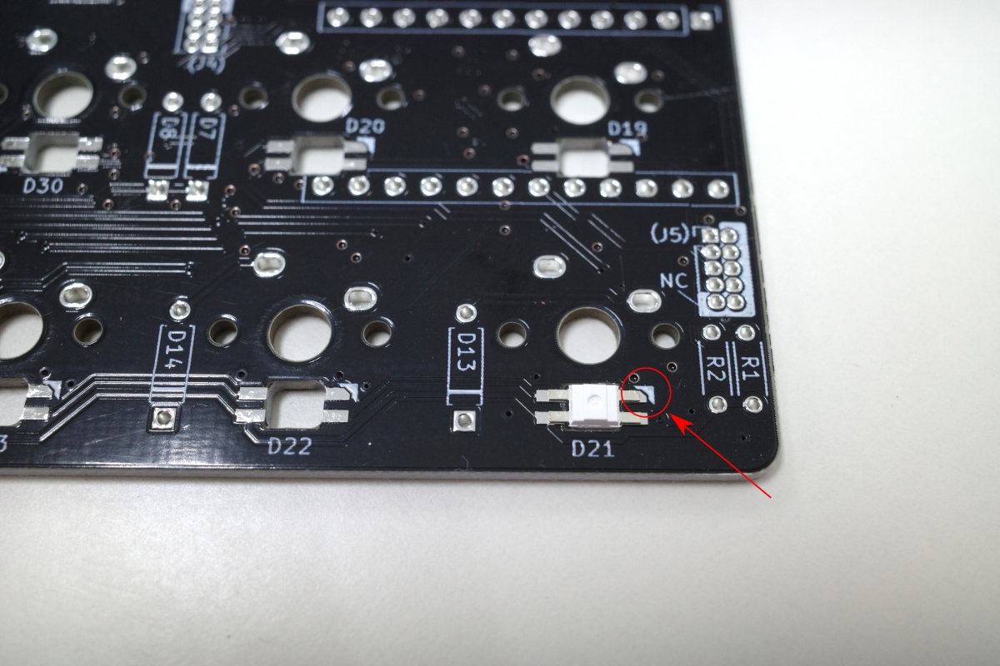
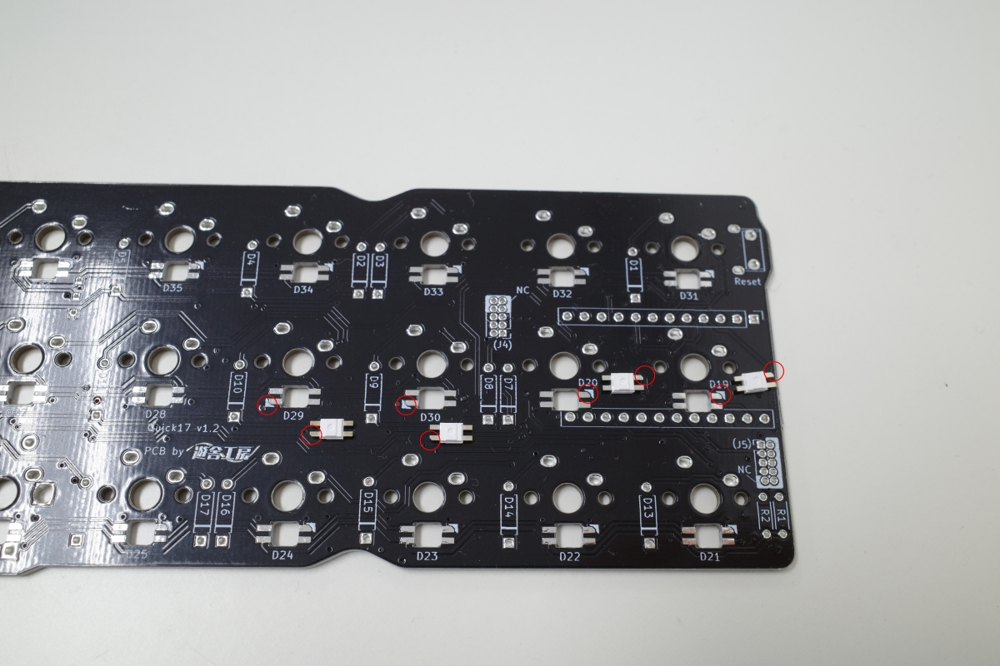
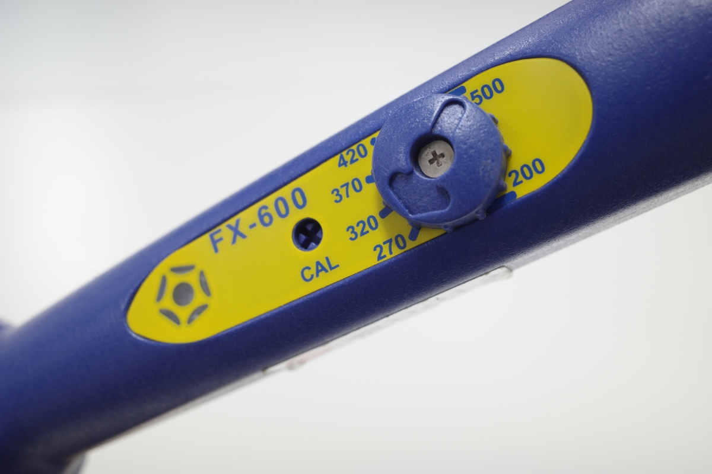
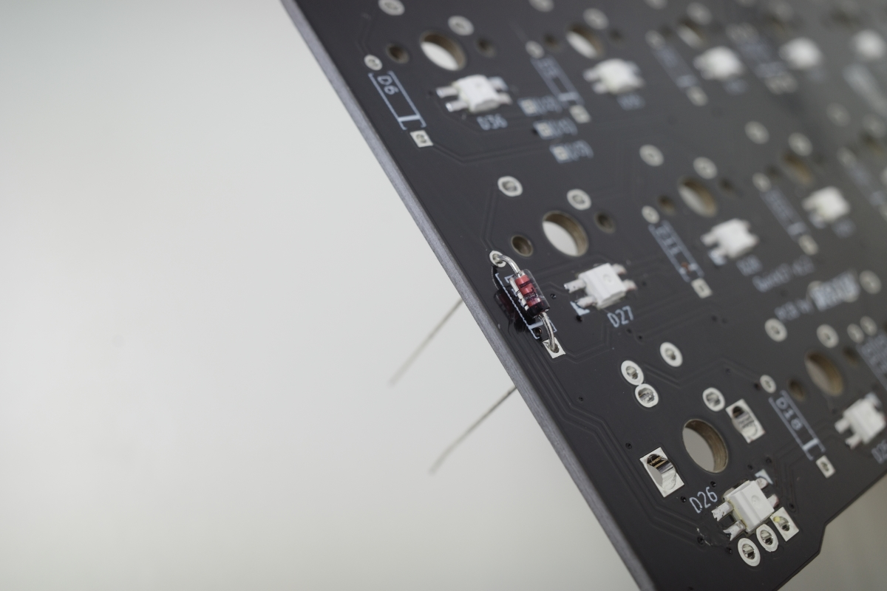
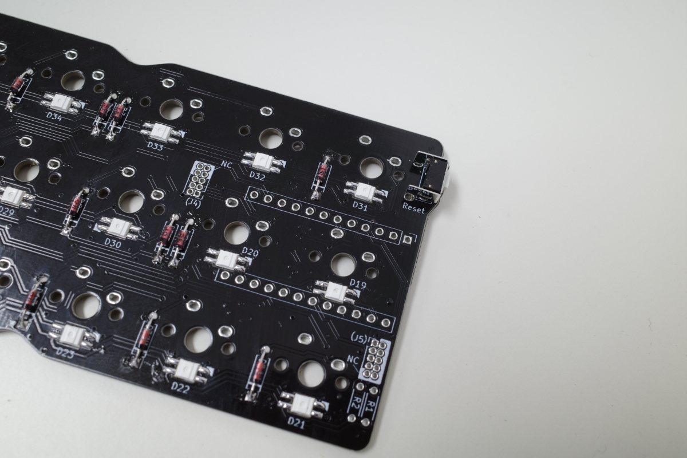
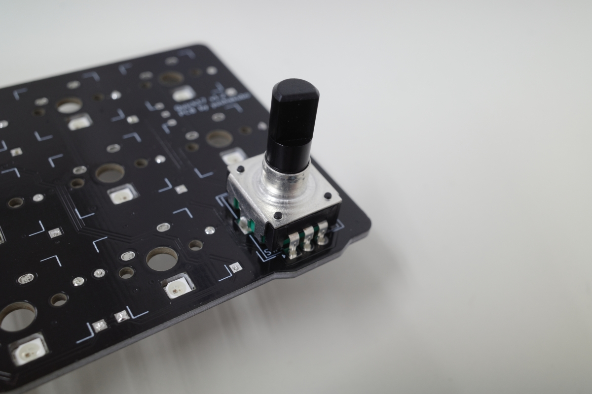
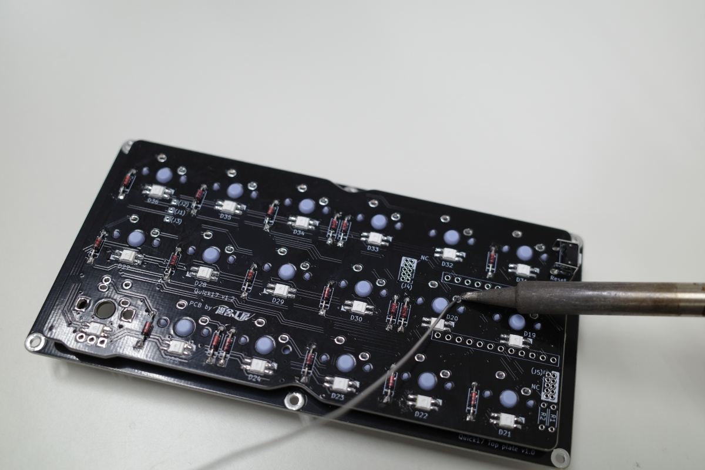
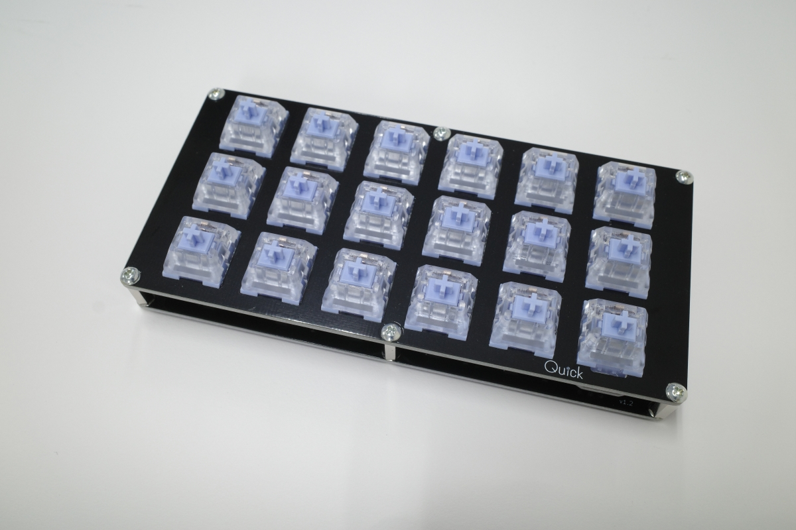

# Quick17 ビルドガイド

## 共通の部品

|名称|数量|備考|
|---|---|---|
|基板|1|
|トッププレート*|1|
|ボトムプレート*|1|
|M2 10mm スペーサー*|6|
|M2 4mm ネジ*|12|
|ダイオード|18|スルーホールのみ対応|
|ProMicro|1|
|コンスルー|2|12pin,高さ2.5mmのものを使用|
|SK6812MINI-E|18|
|リセットスイッチ|1|

アスタリスク(*)の付いた部品はスチールケースセットには付属しません(替わりにスチールケースが付属します)。

### オプション部品

|名称|数量|備考|
|---|---|---|
|ロータリーエンコーダ|1|スイッチ付きのものにも対応|
|ノブ|1|選択したロータリーエンコーダに対応するもの|

## 必要な道具

|名称|備考|
|---|---|
|はんだごて|LEDの取り付けを行う場合、温度調節機能付きのもの|
|はんだ線|0.6mm~0.8mm径程度のもの|
|*ドライバー|*スチールケースセットの組み立てには不要です|
|六角レンチ|ロータリーエンコーダー用ノブを取り付ける際に必要になる場合があります|

## 組み立ての前に

**実際の組み立てを始める前に、このビルドガイドを最後までお読みください。**

組み立てには先端の熱くなるはんだごてを使用します。作業を中断し席を離れる際などは電源を切るなどし、やけどや怪我には十分ご注意ください

## 組み立ての手順

1. LEDのはんだ付け
1. ダイオードのはんだ付け
1. リセットスイッチのはんだ付け
1. (オプション)ロータリーエンコーダーの取り付け
1. キースイッチの取り付け
1. キースイッチ/ロータリーエンコーダーのはんだ付け
1. ファームウェアの書き込みと動作確認
1. キーキャップの取り付け

## 1. LEDのはんだ付け

基板の`L`字の印とLEDのピン部分の切り欠きが合うように乗せます。

***このとき、2列目基板右側2つのLED(D19,D20)については向きが異なりますので、十分注意して取り付けを行います。***

温度調節機能付きはんだごての設定温度を270℃程度にし、LEDをはんだ付けしていきます。

## 2. ダイオードのはんだ付け

基板上`[Dxx  |]`の印に部分にダイオードを取り付けます。白い線、または四角い穴にダイオード表面の黒い帯を合わせて差し込み、はんだ付けします。

長く余ったダイオードの脚は適当な長さに切りそろえます。

## 3. リセットスイッチのはんだ付け

基板右端、`Reset`とある部分にリセットスイッチを取り付けはんだ付けします。

## 4. (オプション)ロータリーエンコーダーの取り付け

基板を裏返し、ロータリーエンコーダーを取り付けます。スチールケースセットの場合、以降取り付けるためにはキースイッチのはんだを取り除く必要がありますので、ここでの取り付けを強くお勧めします。

## 5. キースイッチ取り付け

プレート、またはスチールケースにスイッチをはめ込みます。キースイッチには向きがありますのでご注意くさい。

## 6. キースイッチ/ロータリーエンコーダーのはんだ付け

キースイッチ/ロータリーエンコーダーの各ピンをはんだ付けします

## 7. ファームウェアの書き込みと動作確認

Quick17はファームウェアとしてqmk_firmwareを使用しています。[公式のDocs](https://docs.qmk.fm/#/ja/)のとおりに環境を用意し、書き込みます。

コマンドラインからの書き込みを予定している場合、必要な環境のダウンロードに時間がかかることがあるため、前もってダウンロードを進めておくとスムーズです。

入力のテストには[こちら](htps://config.qmk.fm/#/test)が便利です。

デフォルトで点灯するLEDの動作や光り方に問題がある場合は、隣り合ったLEDのピンをはんだごてで温め直すことで多くの場合改善が見られます。
 
問題なく動作した場合はトッププレート/ボトムプレートにスペーサーをネジ止めします。

## 8. キーキャップの取り付け

最後にキーキャップを取り付けて完成です。

