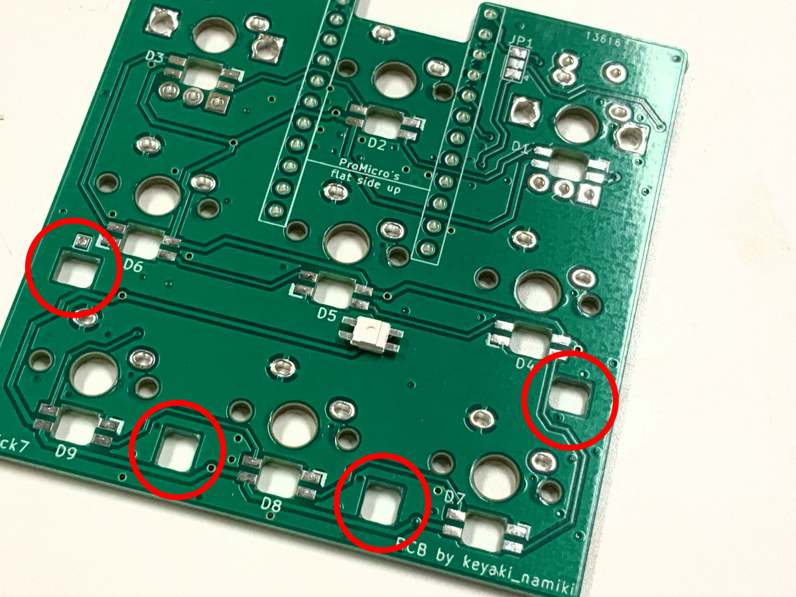

# Quick7 Buildguide

## Required Parts

|Description|qty|note|
|---|---|---|
|PCB|1|
|Top Plate|1|
|Bottom Plate|1|
|Pro Micro (or other compartibles)|1|"Sparkfun Qwiic Pro Micro" is not supported|
|Contrough|2|XB-3-2.5-12P from [MAC8](https://www.mac8japan.com/)|
|Reset switch|1|
|M2 10mm Stand-offs|4|Flat diameter 3mm|
|M2 4mm Screw|8|
|Cherry MX compatible keyswitches|7~9|Depends on Qty of Rotary Encoder|
|Cherry MX compatible keycaps|7~9|Depends on Qty of Rotary Encoder|
|Rubber feet|4|
 

### Optional Parts

|Description|qty|note|
|---|---|---|
|Acrylic Middle Plate|1|10mm Thick|
|LED(YS-SK6812MINI-E)|13|for Backlighting, Underglow|
|Rotary Encoder|1~2|Alps EC12E compatible, w/Pushswitch available|
|Knob|1~2|
 

## Tools

|Name|Note|
|---|---|
|Soldering iron|When use with YS-SK6812MINI-E, make sure that is tempreture controllable|
|Lead solder|0.6mm-0.8mm diameter|
|Precision nippers|
|Screwdriver|PH1|
 

### Schematic is [here](Quick7.pdf)

## Before getting started
Please check the entire steps of this build at first.

***For this build, we will handle a very hot soldering iron. If you leave your seat during the work, be sure to turn off the power and be careful not to get burned or injured.***

## Build steps
Here is the summary of building Quick7 keyboard.

1. Solder small parts
    1. YS-SK6812MINI-E LEDs
    1. Reset switch
    1. Conthrough (XB-3-2.5-12P)
1. Install main parts
    1. Switches
    1. Rotary Encoder(s)
1. Solder main parts
1. Install Pro micro
1. Flash firmware, test it
1. Assemble case
1. Put keycaps, Knob(s) and Rubber feets on

## 1. YS-SK6812MINI-E LEDs

White "L" shape indicates here to apply small cutout.
***The direction changes on each line.***

**Set the temperature of Soldering iron to 270 degree Celsius or less.**
Parts oter than LEDs have a certain level of heat resistance and can be used at about 320 degree Celsius.

For UnderGlow, use these holes and solder from backside.

## 2. Reset switch

Install the reset switch and solder from backside.

Parts we soldered so far (backside view).

(frontside view)

## 3. Contrough (XB-3-2.5-12P)

The small windows shud be on the Pro Micro side.
***DO NOT SOLDER WITH MAIN PCB.***

**Remove** Pro Micro when soldering completed.

## 4. Install Switches

Check the orientation of Top Plate and mount switches on.

## 5. Install Rotary encoder(s)

Put Rotary encoder(s) on the top side of main board (SW10/SW11).

## 6. Solder Switches and Rotary encoder(s)

Before start soldering switches, cut legs of them indicated here.

Then, solder all pins

and Rotary Encoder(s).

## 7. Install Pro Micro

Put Pro Micro (removed from PCB at step.3) on the board.

## 8. Flash firmware, test it

Please refer [Official Documentations](https://docs.qmk.fm/) of qmk_firmware and flash your firmware.

## 9. Assemble case

Put standoffs on PCB with screws.

When use middle plate, insert it between now.

## 10. Put keycaps, Knob(s) and Rubber feets on

