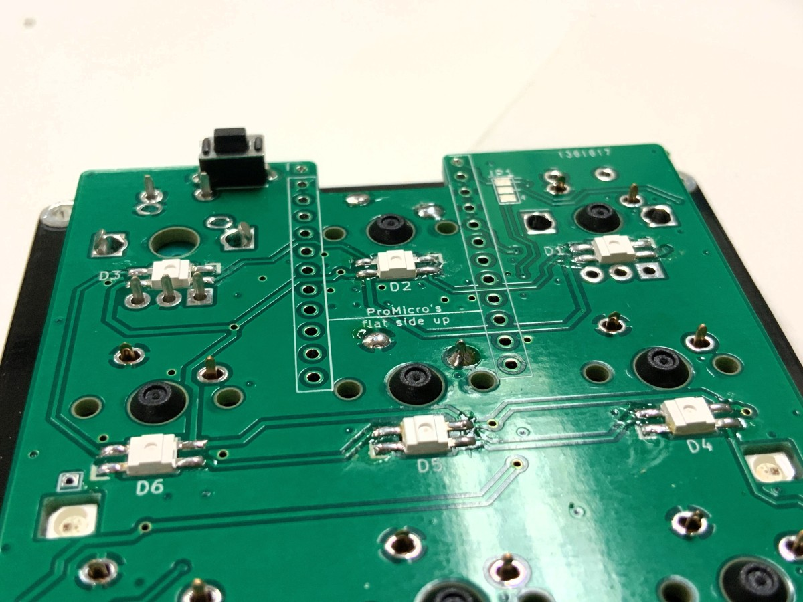

# Quick7 Buildguide

## Required Parts

|Description|qty|note|
|---|---|---|
|PCB|1|
|Top Plate|1|
|Bottom Plate|1|
|Pro Micro (or other compartibles)|1|"Sparkfun Qwiic Pro Micro" is not supported|
|Contrough|2|XB-3-2.5-12P from [MAC8](https://www.mac8japan.com/)|
|Reset switch|1個|
|M2 10mm Stand-offs|4|Flat diameter 3mm|
|M2 4mm Screw|8|
|Cherry MX compatible keyswitches|7~9|Depends on Qty of Rotary Encoder|
|Cherry MX compatible keycaps|7~9|Depends on Qty of Rotary Encoder|
|Rubber feet|4|
 

### Optional Parts

|Description|qty|note|
|---|---|---|
|Acrylic Middle Plate|1|10mm Thick|
|LED(YS-SK6812MINI-E)|13|for Backlighting, Underglow|
|Rotary Encoder|1~2|Alps EC12E compatible, w/Pushswitch|
|Knob|1~2|
 

## Tools

|Name|Note|
|---|---|
|Soldering iron|When use with YS-SK6812MINI-E, make sure that is tempreture controllable|
|Lead solder|0.6mm~0.8mmのもの|
|Precision nippers|
|Screwdriver|PH1|
 

### Schematic is [here](Quick7.pdf)

## Before getting started
Please check the entire steps of this build at first.

***For this build, we will handle a very hot soldering iron. If you leave your seat during the work, be sure to turn off the power and be careful not to get burned or injured.***

## Build steps
Here is the summary of building Quick7 keyboard.

1. Soldering small parts
    1. YS-SK6812MINI-E LEDs
    1. Reset switch
    1. Conthrough
1. Install main parts
    1. Key switches
    1. Rotary Encoder(s)
1. Solder main parts
1. Install Pro micro
1. Flash firmware, validation
1. Assemble case
1. Put keycaps, Knob(s) and Rubber feets on

## 1. YS-SK6812MINI-E LEDs
White "L" shape indicates here to apply small cutout.
***The direction changes on each line***

**Set the temperature of Soldering iron to 270 degree Celsius or less**
LED以外の部品については一定の耐熱があるので320℃程度で使用できます。

For UnderGlow, use this hole and solder from backside.

## 2. Reset switch
基板上Resetとある位置にタクトスイッチを取り付け、はんだ付けします。

ここまでのはんだ付けが終わった状態(ウラ面)

(オモテ面)

## 3. コンスルーのはんだ付け
左右とも同じほうから穴が見えるように置き、Pro Micro 又は Elite-Cとコンスルーをはんだ付けします。***写真緑の基板とコンスルーははんだ付けしません。***

はんだ付けしたPro Microは一度取り外します。

## 4. キースイッチの取り付け
トッププレートの向きと裏表に気をつけながら、すべて同じ向きになるようにキースイッチをはめ込みます。

## 5. ロータリーエンコーダーの取り付け(オプション)
基板おもて側、白丸のある面からロータリーエンコーダーを取り付けます。

## 6. キースイッチ、ロータリーエンコーダーのはんだ付け
キースイッチをはんだ付けする前に、Pro Microと干渉する部分の脚をニッパーで切り落とします。

脚をカットしたら、はんだ付けします。

(使用する場合)あわせてロータリーエンコーダーもはんだ付けします。

## 7. Pro Microの取り付け
一度取り外したPro Microを再び基板に取り付けます。

## 8. ファームウェア書き込み、動作確認
Quick7はファームウェアとしてQMK Firmwareを使用しています。[公式のDocs](https://docs.qmk.fm/)の通りに環境を用意し、書き込みます。

## 9. スペーサーの取り付け
四隅の穴にスペーサーを取り付けます。

ミドルプレートを使う場合、ここであわせて取り付けます。

## 10. キーキャップ、ノブの取り付け
最後にキーキャップとノブ、ゴム足を取り付けて完成です。

